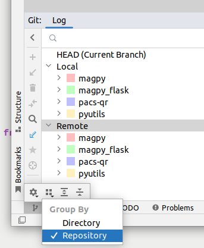
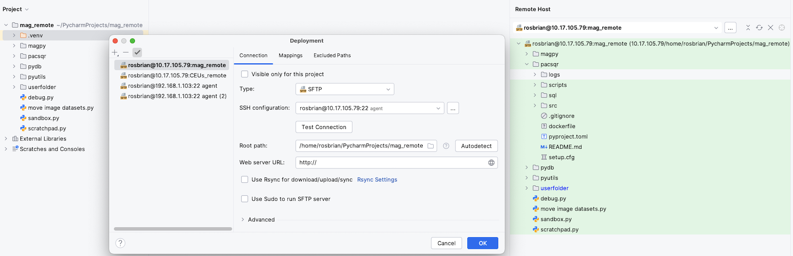
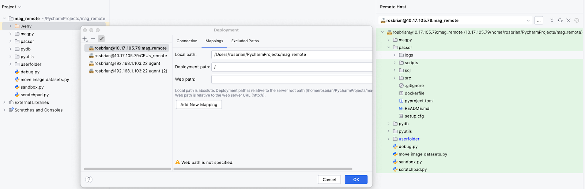
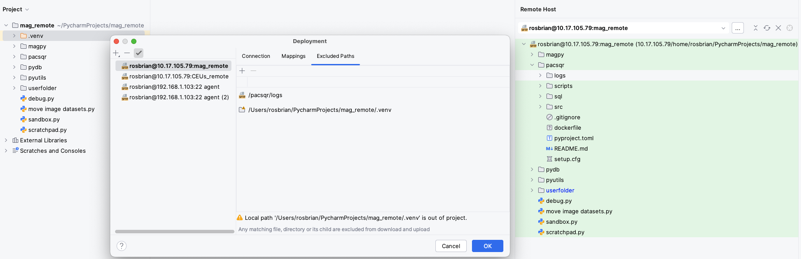

## installation

- check `Create Associations` for .py files on...keep `Add launchers dir to the PATH` off...my understanding is that if this were to be checked on it would allow for the launching of PyCharm from the Command Prompt...this is something you're not really every going to do, however, there's no harm in checking it on
- On MacOS you'll be prompted with something like `Do you want to enable repeating keys in Mac OS X on press and hold?`.  If you hit `No` you'll screw yourself over in that holding down something like `j` won't move the cursor.  See [here](https://stackoverflow.com/questions/39606031/intellij-key-repeating-idea-vim) for ways to change the behaviour.  I ended up quitting PyCharm and issuing `defaults write -g ApplePressAndHoldEnabled 0`.

## setup

- `File > Settings` in Windows or `PyCharm > Preferences` on macOS
    - `Appearance & Behavior` tab then `Appearance`
    - `IntelliJ Light` for `Theme`
    - check `Always show full path in window header` on
    - `Appearane & Behavior` tab, `System Settings` tab
        - check `Confirm before exiting the IDE` off
    - `Editor > General` tab, check `Soft-wrap these files` then add `; *.py` to the list of extensions
    - add a keymap so you can send the selected code in the Editor to the Python Console by hitting `Ctrl + Enter`
        - `Keymap` tab, expand `Plugin`
        - right click `Execute Selection in Python Console` then `Add Keyboard Shortcut`
        - `Ctrl + Enter`, `OK` then `Remove`
            - this will remove all the defualt shortcuts that were mapped to `Ctrl + Enter`
    - for Mac, add a keymap so you can execute the selected SQL by hitting `Ctrl + Enter`
        - `Keymap > Database > Execution > Execution`
        - highlight `Execute` and change the default keymap to `⌃ ↵` (Ctrl + Enter) 
    - `Plugins` tab, install `IdeaVim` and restart the IDE
    - execute one statement
        - `Tools > Database`
        - select `Smallest statement` for `When caret inside statement execute:`
- set the interpreter (which VE to use for the project) and Project Structure (PYTHONPATH) 
    - `Preferences > Project` tab
    - `Python Interpreter` tab and browse to the VE
    - `Project Structure` tab and browse to `~/python` (assuming that `python` is still the name of the directory housing `mypkg` and `scripts`)
        - I had to restart PyCharm in order for `mypkg` to be found.  Despite hitting `Apply` after adding the root content it seems that PYTHONPATH doesn't change until you restart.
- turn off Shared Indexes
    - `File > Settings > Tools > Shared Indexes`
    - `Don't download, use local indexes`

## symbols

Different operating systems have different symbols for the same keys.  [This](http://xahlee.info/comp/unicode_computing_symbols.html) is a great place to look for equivalencies along with copy/pasting unicode characters for various symbols.

### Mac specific

- `⌘` == `cmd`
- `⌃` == `ctrl`
    - This is strange in that Mac keyboards have a `⎈` printed on the key.
- `⌥` == `opt` == `alt`
- `⇪` == `caps lock`
- `⇥` == `tab`
- `⌫` == `delete`

### Windows specific

- `↹` == `tab`
- `❖` == `Windows`
- `✲` == `ctrl`
- `⟵` == `backspace`

### Mac and Windows

- `⇧` == `shift`
- `↵` == `enter`
- `🄰` == `caps lock`
- `⎋` == `esc`
    - I think this is more Mac specific but I can't find a character that's used on Windows keyboards
- `␣` == `space

## shortcuts

### IDE layout

- `shift ⎋` will minimize all tabs.  `F12` will restore the last used pane and put the cursor in it.  This works with DataGrip too.
- `Ctrl + Tab` and `Ctrl + Tab + Shift` to switch tabs
- On MacOS, `Shift + Enter` will make a vertical split in the editor.  This can also be done with `Window > Editor Tabs > Split Right`.  You can also right click on a tab and select `Split Right`.
- `⌘ 1` to toggle Project tab
- `⌘ ⇧ a` envokes `Find Action` while `⇧ ⇧` envokes `Search Everywhere`
- On MacOS, `Preferences > Editor > Color Scheme > General > Text > Default text > Background` for Editor background color
- On MacOS, `Preferences > Editor > Color Scheme > Console Colors > Console > Background` for Terminal and Console background color
    - Oddly, when you hit `Apply` nothing happens but changes will be made when you close the `Preferences` window.
- On MacOS, `Preferences > Editor > Font` to change Editor and Terminal font.
    - I've found that if the Terminal font gets wonky, choose other fonts until it returns to something reasonable.
- `Preferences > Editor > Color Scheme > General` then in the window to the right `Editor > Guides > Hard wrap guide` to change color of vertical line indicating max line length.
- `Preferences > Editor > Color Scheme > General` then in the window to the right `Errors and Warnings > Weak Warning` to change color of underscores showing unneeded spaces.
    

### file navigation

- `⌘ e` opens recent files popup.  Use this when you know the name of the file.
    - `⌫` remove 5 files from the popup
- `⌘ ⇧ e` opens recently opened files.  Use this when you don't know the name of the file.  Type in a word that you know the file contains to narrow search results.

### Editor

- `Shift + F6` to refactor word under cursor
- On MacOS, `⌘` and `click` and/or `⌘ b` on an object to jump to its definition.  On Windows it's `ctrl` and `click`.
- On Windows, with the mouse highlight something that you want to copy then hold `ctrl` while dragging and dropping the highlighted section to copy it.
- `⌥ ↵` to show intentions where the cursor is at
- `⌃ ⇧ r` to run .py file
- `⌘ /` to comment/uncomment
- `⌘ -` to collapse fragment
- `⌘ =` to expand collapsed fragment
- `⌘ ⇧ -` to collapse all regions in file
- `⌘ ⇧ =` to expance all regions in file
- `⌃ ␣` to show suggested arguments
- `⌘ p` while in a method's parenthesis to show its signature (parameters)
- `F1` for short description
- `⌥ ␣` to show declaration
- `⇧ ⌘ -` to collapse all folding, `⇧ ⌘ +` to expand all

### PEP formatting

- `⌘ ⌥ l` to prettify selected lines or if nothing is selected, then the whole file

### error correction and debugging

- `F2` and `F2 shift` to move to next/previous error
- `⌘ F8` to place a breakpoint on line under cursor

## helpers

- when selecting an autocompletion value an `↵` would place the value at the cursor while a `⇥` will overwrite the word under the cursor
- when writing a normal string you can put in the `{` character then an object to automatically switch to a f-string

## working with multiple repos

Currently, I have a PyCharm project called `mag` with a VE in the project directory.  Nothing shocking.  I've cloned `magpy`, `pyutils`, `pacsqr` and `magpy_flask` into the project directory and pip installed them.  How do you handle git with multiple repos in one project?  This took a while to figure out but the answer is simple.  In the `VCS` tab, hover over the `>>` icon in the lower left corner then the `Group by` icon, unselect `Directory` then select `Repository`.  Each repo will now be shown.

## Error while opening due to already running process

On a Mac, when the power goes out an you have a running instance of PyCharm you'll get an error when you attempt to start PyCharm after starting the machine back up.  The solution is to remove this file: `/Users/rosbrian/Library/Application Support/JetBrains/PyCharm2023.2/.lock`.

## remote development

### workflow

- On a remote machine like RDLU0037 create a directory titled something like `example_remote` and create a VE within the directory.  `example_remote` is the deployment directory.  It'll be mapped one-to-one with the local PyCharm project directory.
- `Settings > Project > Python Interpreter` then `Add Interpreter` > `On SSH`
- leave `New` toggled on, put in `Host`, `Username` and hit `Next`
- after introspection of the new connection
    - for `Environment`, toggle `Existing`
    - for `Interpreter`, browse to and select the python file in the remote's VE directory and hit OK
    - for `Sync folders`, browse to the deployment directory and hit OK
        - This is what creates a one-to-one relationship between the local project directory and remote project directory.  All non-excluded files in the local directory will be synced with the remote dierectory.
    - toggle off `Automacially upload project files to server`
        - You might be changing this later after all the exclusions have been figured out.  However, if this remains toggled on everything in the local project directory will start to be copied to the remote directory the second you hit `Create`, which is probably not what you want to have happen.
    - `Create`
- `OK` to close `Settings` window
- rename the remote interpreter
    - `Settings > Project > Python Interpreter`
    - expand the drop down menu then `Show All...
    - the remote interpreter that was just added will have a name like `Remote Python 3.11.11 (sftp://rosbrian@dgs-ap-ps3a:22/home/rosbrian/example_remote/venv/bin/python3.11)`.  Right click on it, `Rename` and use the naming convention *\<hostname\>:\<deployment directory name\>:\<python version\>*, e.g. `dgs-ap-ps3a:example_remote:python3.11`.
    - `OK` x 2
- configure deployment
    - `Tools` > `Deployment` > `Configuration`
        - `Connection` tab
            - rename deployment configuration
                - The pane on the left side has deployment configurations.  There's one entry per remote virtual environment that's been added.  New entries follow the naming convention *\<user\>@\<hostname\>:\<port\> agent*.  Right click the one that corresponds with the remote virtual environment that's just been added, `Rename` and use the naming convention *<hostname>:<deploy directory name>*, e.g. `dgs-ap-ps3a:example_remote`.
            - rename SSH configuration
                - The `SSH configuration` drop down menu has all SSH connections/configurations that have been added.  The corresponding SSH configuration to the deployment configuration will be pre-populated.  Hit the elipsis button next to it, right click the entry in the left pane, `Rename` using the naming convention *\<user\>@\<hostname\>*, e.g. `rosbrian@dgs-ap-ps3a`.
                - `OK`
            - I leave the `Root path` at the default `/`.  Whatever you put here is what'll be displayed in the `Remote Host` tool window.
        - `Mappings` tab
            - The `Deployment path` should be set to the deployment directory.  Again, there's a one-to-one relationship between the `Local path`, which is the local PyCharm project directory and the `Deployment path`, which is the remote deployment directory.
        - `Excluded Paths` tab
            - Local paths are relative to the `Local path` in the `Mappings` tab.
            - Remote paths are relative to the `Root path` in the `Connection` tab.
            - Add both local and remote VE directories and all local *<package name>.egg-info* directories.
- Right click the local project dir in the `Project` tool window, `Deployment` > `Sync with Deployed to ...` and select a deployment configuration if you haven't set a default for the project.
    - If things look good, go ahead and sync.  If not, add/remove excluded paths and refresh until you've got everything set.
- `Tools` > `Deployment` and toggle on `Automatic uploads`

I want to note here that we have named 1) a remote virtual environment, 2) a deployment configuration and 3) a SSH configuration using 3 different naming conventions.  As long as you stick with the same naming conventions, you'll be able to easily differentiate what's what.  PyCharm does an awful job of reusing the same name for the deployment and SSH configurations by default, making it very confusing to a beginner.

#### deployment configuration

- copy the local VE's absolute path
- `Tools` > `Deployment` > `Configuration`
    - I've found that on the Pi 5, it'll appear that PyCharm has frozen, just wait.

##### Connections tab

- Right click and `Rename` the deployment name in the upper left pane using the convention `<hostname>:<remote deployment directory name>`.
- Right click and `Use as default` the deployment name that you want to associate the project to.
- Change the *Root path* if needed.  Remember that 1) this corresponds to the top of the tree of the *Remote Host* menu and 2) all remote paths that are set in the following *Mappings* and *Excluded Paths* tabs are relative to this path.  Typically, I'll set the root path to the remote deployment directory.

##### Mappings tab

- If the *Root path* in the *Connections* tab was set to the remote deployment directory, the *Deployment path* here can be set to `/` since it's relative to the *Root path*.

##### Excluded Paths tab

- Add a local path and paste the absolute path to the local VE that you'd copied.
- Add a remote path for the remote VE.  If the *Root path* in the *Connections* tab was set to the remote deployment directory, you can simply use the directory name of the remote VE.
- Add both local and remote *egg-info* paths.  Remember, local paths need to be absolute but remote paths are relative to the *Root path*.
    - It's a pain, but add them all before the first attempt at syncing.  It'll go faster without having to index everything.

#### syncing and followup

- After hitting `OK` in the *Deployment* window, `Tools > Deployment > Sync with Deployed to <deployment name>` to verify that the excluded paths are working and sync if so.
    - for each repo, add remote paths to the `.egg-info` dirs if you hadn't preemptively added them
- `Tools > Deployment > Automatic Upload` to turn it on
- On the remove VE, pip install the repos that were just copied from the local.

### usage

- The IDE seems to be smart enough to ignore the .git files in the repos when copying to the remote.
    - That the .git dir isn't copied is great.  If not, you could have a different branch checked out on the local machine, update the remote and bango, you've got the same data on different branches without a commit to demarcate it.
- Using rsync seems to need to authenticate every time something is transferred so I'm not using it.
- When switching branches locally, you'll need to manually sync.
- When jumping to source, the local interpreter is used.  E.g. on the Mac, you can hold Cmd while hovering over an object to make a link that you can click on.  The link resolves to the local file.
- When you open a remote file and alter it, you need to "upload" to save the changes.  Think of "upload" as saving.
- In the remote deployment directory, it can be helpful to make symlinks to directories of interest.  That way, you can stay in the remote dir in the IDE and have access to the remote file system without having to browse.  You don't need to add symlinks in the Excluded Paths.
- Don't alter a remote file since it doesn't autosave.  Instead, right click the remote file and `Download`.  It'll show up in your local project directory.  After working on the file, upload it and delete locally.
- A default deployment name can be selected by right clicking on in the Deployment Configuration tool.  The current deployment name shows at the bottom middle of the IDE's window.

